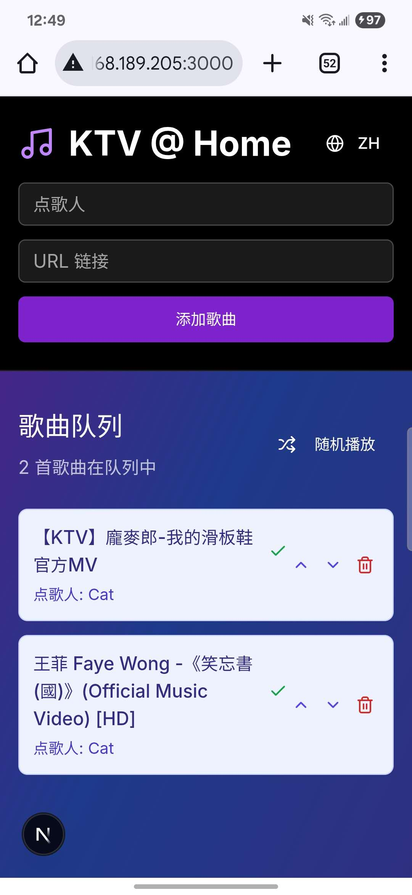

# KTVGen

## Description:

**ktvgen** is a fullstack karaoke generator with a web app and CLI tool. It allows users to input song links, separate vocals and instrumentals using AI, and generate KTV-style videos. The project uses React and Tailwind on the frontend, FastAPI with SQLModel on the backend, and relies on `yt-dlp`, `demucs`, `ffmpeg`, and `torch` for audio processing.

## CLI
```
pip install -e .
ktvgenerate --link ... --video
```

## Frontend (In Progress)
```
cd frontend
pnpm install
pnpm run dev
```


## Backend (In Progress)

## License

This project is licensed under the MIT License.  
See the [LICENSE](./LICENSE) file for details.

**Disclaimer:** This tool is intended for educational and personal use only.  
Please respect [YouTube’s Terms of Service](https://www.youtube.com/t/terms) and the rights of content owners.


## TODO
- [ ] Finish frontend
- [ ] Debug APIs
- [ ] Issue: foreign characters not showing in folder names
- [ ] Issue: skip download/processing when files already existed
- [ ] Add options for better audio quality
- [ ] Add cuda accelaration for 
...